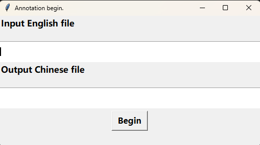
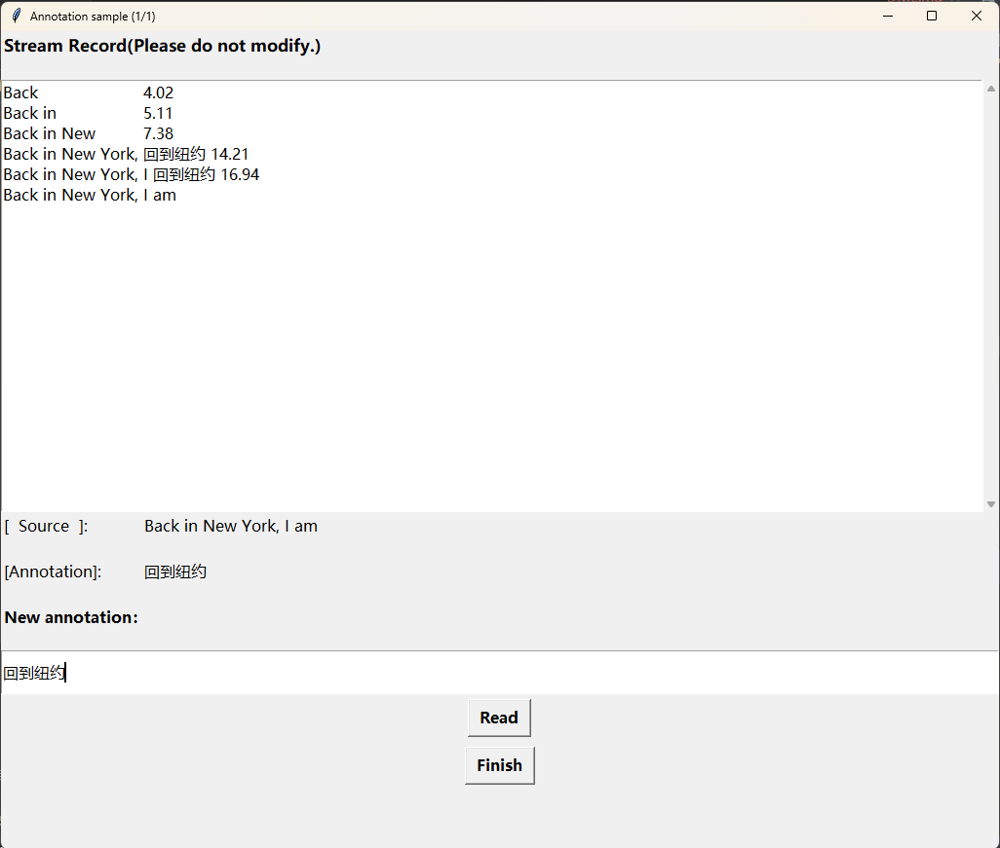

# SiMuST-C

### Introduction
Simultaneous machine translation (SimulMT) models start translation before the end of the source sentence, 
making the translation monotonically aligned with the source sentence. 
However, the general full-sentence translation test set is acquired by offline translation of the entire source sentence, 
which is not designed for SimulMT evaluation, making us rethink whether this will underestimate the performance of SimulMT models. 
In this work, we manually annotate a monotonic test set based on the MuST-C English-Chinese test set, 
denoted as SiMuST-C. Our human evaluation confirms the acceptability of our annotated test set.
Evaluations on three different SimulMT models verify that the underestimation problem can be alleviated on our test set.

### Resource Released
We release our annotated SiMuST-C test set, and the annotation tool we use.

### Quick Start
We first introduce the information of SiMuST-C and evaluation results, 
then we use an example to show the annotation method.

##### Introduction of SiMuST-C
Our annotation is based on [MuST-C v2.0 English-Chinese dataset](https://ict.fbk.eu/must-c/), 
in which the tst-COMMON set is viewed as test set, as seen in the `test-orig` dir.

We annotate all 2841 English sentences in the `test-orig` to build `test-mono`.
All annotated Chinese sentences could be found in `./test-mono/test.annotation.zh`,
and the annotation stream is saved in `./test-mono/test.annotation.stream`.

Here we show the comparison between test-orig and test-mono:

| Metrics | test-orig | test-mono |
| --- | --- | --- |
| Human Score | 4.24 | 4.08 |
| Acceptability | 92.7% | 89.7% |
| Average Anticipation | 1.47 | 0.77 |
| Average Lagging | 15.65 | 2.71 |

While maintaining comparable manual scoring, 
our test-mono contains fewer anticipation phenomena 
and guarantees low latency, 
so it is more monotonic 
and more suitable for simultaneous translation evaluation.
 
##### Annotation Example
1. Build annotator

```
# build annotator, default build path is ./dist/text_annotate.exe
pyinstaller -F -w text_annotate.py

# prepare example file
cp example.en ./dist/
```

2. Start annotation

    Double click to open `text_annotate.exe` file. (windows only)

- select english file

    Input a file containing English text for annotation, such as `example.en`, 
    and specify the output file name, such as `example.zh`.
    
    
   


- annotate in stream style

    Next is an example of labeling an English sentence. 
    Annotators need to click the **'Read'** button to read the next source word, 
    and enter the Chinese translation in the **'New annotation'** input box. 
    After all the reading and translation are finally completed, 
    click the **'Finish'** button to end the translation of this sentence. 
    If all the sentences in the input file have been annotated, 
    the annotator will automatically exit.
    
     

### Licence
Our dataset is licensed under the CC BY 4.0 and our code is licensed under the Apache License 2.0.

### Paper

Rethinking the Reasonability of the Test Set for Simultaneous Machine Translation

Mengge Liu, Wen Zhang, Xiang Li, Jian Luan, Bin Wang, Yuhang Guo, Shuoying Chen 

If you'd like to use our testset or cite this paper, please kindly use the reference below:

```
@article{liu2023rethinking,
  title={Rethinking the Reasonability of the Test Set for Simultaneous Machine Translation},
  author={Liu, Mengge and Zhang, Wen and Li, Xiang and Luan, Jian and Wang, Bin and Guo, Yuhang and Chen, Shuoying},
  journal={arXiv preprint arXiv:2303.00969},
  year={2023}
}
```

### Acknowledgement

This work was also assisted by the research group of Dr. Guo Yuhang of Beijing Institute of Technology.